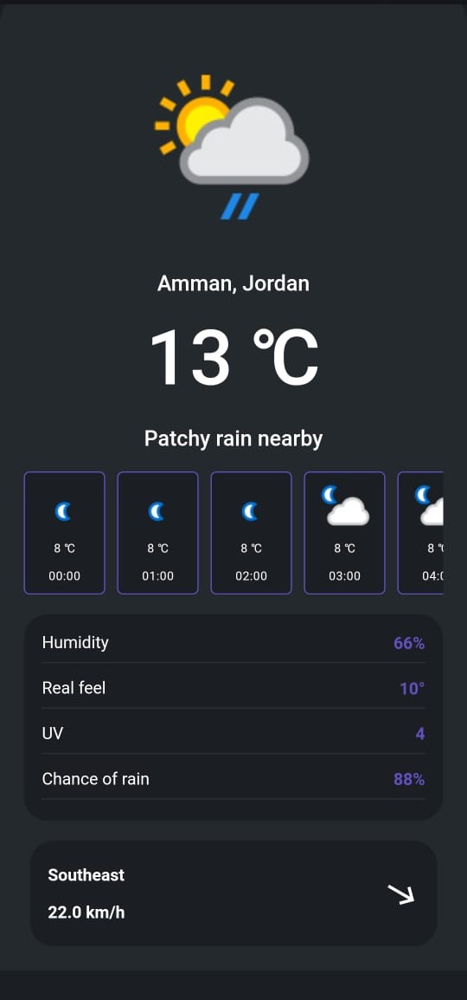
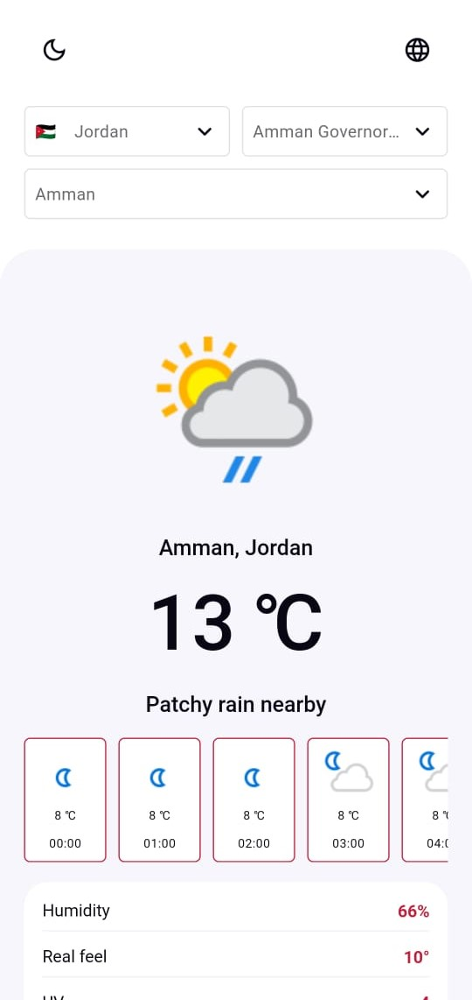

# Weather Task

A Flutter application for displaying weather information.

## Description

Weather Task is a mobile app built with Flutter that allows users to view weather information for different locations. Users can search for cities, view current weather conditions, and see forecasts for the upcoming days.

## ScreenShots

<p float="left">
  
  
</p>


## Dependencies
-  cupertino_icons
-  get
-  logger
-  flutter_screenutil
-  dio
-  pretty_dio_logger
-  shared_preferences
-  csc_picker
-  flutter_spinkit
-  cached_network_image
-  shimmer
-  intl
-  flutter_animate


## Installation

1. Clone the repository:

   ```bash
   git clone https://github.com/yourusername/weather-task.git

## Install dependencies

2. pub-get:

   ```bash
   cd weather-app
   flutter pub get


## Usage

3. To run the app on a simulator or device:

 ```bash
   flutter run
